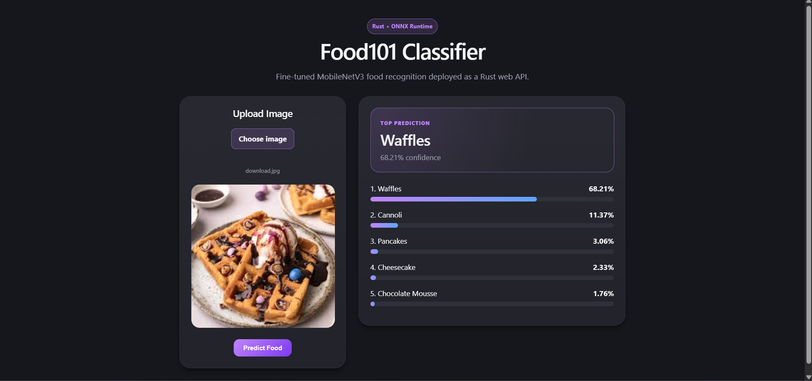
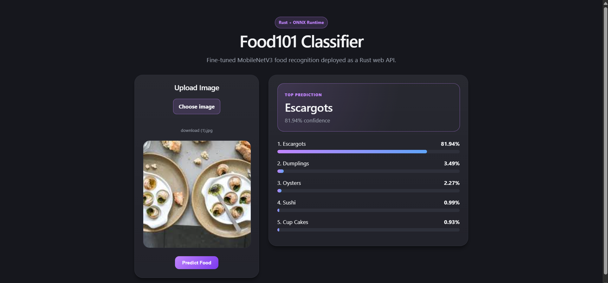

# Food101 Production Image Classification System

A production-ready image classification system built using a fine-tuned MobileNetV3 model trained on the Food101 dataset.

The project began as a transfer learning and fine-tuning study comparing multiple convolutional neural network architectures and evolved into a deployed machine learning system featuring ONNX inference, a Rust backend, monitoring endpoints, Docker deployment, and CI/CD automation.

---

## Live Demo

### Frontend

https://food101-rust-deploy.vercel.app/

### Backend API

https://food101-rust-deploy.onrender.com

---

## Final Model Performance

| Metric         | Score  |
| -------------- | ------ |
| Top-1 Accuracy | 76.52% |
| Top-5 Accuracy | 93.76% |

**Dataset:** Food101

**Architecture:** MobileNetV3 Large

**Deployment Format:** ONNX

---

## Model Selection Process

Three transfer learning architectures were evaluated under identical training conditions.

| Model       | Top-1 Accuracy | Top-5 Accuracy |
| ----------- | -------------- | -------------- |
| GoogLeNet   | 49.30%         | 76.82%         |
| ResNet50    | 59.84%         | 84.19%         |
| MobileNetV3 | 60.15%         | 84.44%         |

MobileNetV3 was selected due to its balance between classification performance and computational efficiency.

### Fine-Tuning Results

| Experiment              | Top-1 Accuracy | Top-5 Accuracy |
| ----------------------- | -------------- | -------------- |
| Fine-Tuned Exp1         | 72.84%         | 92.07%         |
| Fine-Tuned Exp2         | 74.08%         | 92.61%         |
| Final Extended Training | **76.52%**     | **93.76%**     |

---

## System Architecture

```text
User Upload
      ↓
React Frontend (Vite)
      ↓
Rust Backend (Axum)
      ↓
Image Preprocessing
      ↓
ONNX Runtime
      ↓
MobileNetV3 Large
      ↓
Top-5 Predictions
```

---

## Tech Stack

### Machine Learning

* PyTorch
* Transfer Learning
* Fine-Tuning
* ONNX

### Backend

* Rust
* Axum
* Tokio
* ONNX Runtime

### Frontend

* React
* Vite
* Axios

### Deployment

* Docker
* Render
* Vercel

### MLOps

* GitHub Actions CI/CD
* Monitoring Endpoints
* Model Metadata APIs

---

## Features

* Upload food images through a web interface
* Real-time ONNX inference
* Top-5 prediction display
* Confidence score visualization
* Rust-based inference backend
* Dockerized deployment
* Monitoring and metrics endpoints
* Automated CI/CD validation

---

## API Endpoints

### Health Check

```http
GET /health
```

### Prediction

```http
POST /predict
```

Returns the Top-5 predicted Food101 classes.

### Monitoring

```http
GET /metrics
```

Example Response:

```json
{
  "total_predictions": 1247,
  "avg_latency_ms": 34,
  "total_errors": 2,
  "model_version": "v1.0.0"
}
```

### Model Metadata

```http
GET /model-info
```

Example Response:

```json
{
  "model": "MobileNetV3 Large",
  "dataset": "Food101",
  "top1_accuracy": 76.52,
  "top5_accuracy": 93.76,
  "format": "ONNX"
}
```

---

## Example Predictions

| Image               | Prediction          | Confidence |
| ------------------- | ------------------- | ---------- |
| Pizza               | Pizza               | 99.9%      |
| Paella              | Paella              | ~100%      |
| Gyoza               | Gyoza               | 90.9%      |
| Spaghetti Carbonara | Spaghetti Carbonara | 87.8%      |

---

## Out-of-Distribution Examples

The model is trained exclusively on the Food101 dataset and therefore performs closed-set classification.

Examples:

| Actual Food   | Predicted Class   |
| ------------- | ----------------- |
| Chole Bhature | Breakfast Burrito |
| Dosa          | Hot Dog           |
| Vada Pav      | Beef Tartare      |

These examples highlight the limitations of classification systems when encountering foods outside the training distribution.

---

## CI/CD

GitHub Actions automatically validates every push by:

* Building the Rust backend
* Building the React frontend
* Verifying dependency integrity

This ensures that new commits do not break the deployment pipeline.

---

## Local Development

### Backend

```bash
cd backend
cargo run
```

### Frontend

```bash
cd frontend
npm install
npm run dev
```

---

## Screenshots





---

## Future Improvements

* MLflow experiment tracking
* Prometheus / Grafana monitoring
* Model version registry
* Automated deployment workflows
* Additional lightweight architectures

---

## Project Outcomes

This project demonstrates:

* Computer Vision
* Transfer Learning
* Fine-Tuning
* Model Selection
* ONNX Model Export
* Rust Inference Systems
* Docker Deployment
* Monitoring
* CI/CD
* Production ML Engineering Practices
